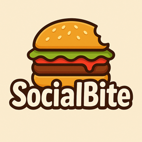
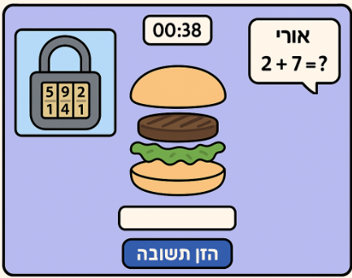

# 🎮 SocialBite  
**שתפו פעולה, פתרו חידות, וביחד תיצרו את המנה הטעימה בעולם!**

---

## מהות המשחק

  משחק מחשב שיתופי, דו־ממדי, המיועד לבני נוער על הרצף האוטיסטי (בעלי תפקוד גבוה).  
מטרת המשחק היא לשפר מיומנויות חברתיות כגון תקשורת, שיתוף פעולה וחשיבה משותפת – תוך כדי חוויה מהנה, קלילה ומאתגרת.
בתחילת המשחק המטפלת בוחרת חידתי או חברתי, במידה וחברתי מזינה פרטים אישיים על כל אחד מהמשתתפים, כך שיגלו דברים חדשים אחד על השני במהלך המשחק, 
במידה וחידתי זה אך ורק חידות.

בתחילת המשחק השחקנים מכניסים את שמותיהם, ובוחרים מנה שירצו להכין.
יש 3 שלבים ובכל שלב השחקנים צריכים לשתף פעולה כדי לפתור חידות שונות.  
פתרון נכון מעניק לכל אחד מהם מרכיב להכנת המנה לדוגמה: חסה, לחמנייה, קציצה, עגבנייה וכו’.  
בסיום שלושת השלבים, כאשר כל המרכיבים נאספו, הם ירכיבו יחד את המנה המושלמת!

**פלטפורמה:** מחשב אישי (PC)  
**סגנון:** דו־ממד  
**משך ממוצע של שלב:** כ־2 דקות

---

## רכיבים רשמיים

### 1. שחקנים
- קהל היעד: בני נוער עם אוטיזם בתפקוד גבוה, המעוניינים לשפר כישורי שיתוף פעולה ותקשורת.  
- מספר שחקנים: 2–3.  
- אופי המשחק: שיתופי. כל שחקן מחזיק חלק מהמידע הדרוש לפתרון, והם נדרשים לתקשר כדי להצליח.  
- הייצוג במשחק: כל שחקן מזוהה לפי שמו במשחק.

---

### 2. יעדים
* להשלים את שלושת השלבים על־ידי פתרון החידות הקבוצתיות.  
* לאסוף את כל מרכיבי המנה ולהרכיב את המנה המושלמת.  
* המשחק מציג את היעדים בתחילת כל שלב ובממשק הראשי באמצעות תצוגת התקדמות (Progress Bar).

---

### 3. תהליכים

**תחילת המשחק (30 שניות ראשונות):**  
המשחק נפתח באינטרו קצר המציג סיפור רקע הומוריסטי ומזמין (“המטבח הקבוצתי סגור! רק אתם יכולים להרכיב את ההמבורגר האגדי!”).  
לאחר מכן מופיע טוטוריאל שמדגים בצורה אינטראקטיבית את שלבי המשחק, הלחיצות, והאופן בו יש לתקשר.

**תהליך הליבה:**  
בכל שלב, כל שחקן מקבל חלק אחר של חידה (רמז, תמונה, או נתון מספרי).  
רק על ידי שיתוף המידע בין השחקנים ניתן לפתור את החידה ולהשיג את המרכיב הבא.  
השחקנים משתמשים בעכבר ובמקלדת כדי להזיז, לבחור, להקליד ולשתף תשובות.

**תהליך הסיום:**  
כאשר כל המרכיבים נאספו, מוצגת סצנה צבעונית בה המנה מורכבת בהדרגה, יחד עם אנימציה קלילה ופידבק חיובי (“איזה צוות טעים אתם!”).  

**למידת התהליכים:**  
באמצעות טוטוריאל אינטראקטיבי לפני כל שלב, המסביר בפשטות ובצורה מוחשית כל פעולה נדרשת.

---

### 4. חוקים
* ניתן לענות על כל חידה רק לאחר שכל השחקנים תרמו מידע.  
* הגבלת זמן לכל שלב (ניתנת לשינוי לפי דרגת קושי).  
* אם השחקנים מתקשים, נפתחים רמזים במרווחים קבועים.  
* לאחר שכל הרמזים מוצגים – מופיע כפתור “ריסט לשלב”.  
* השחקנים לומדים את החוקים באמצעות הסבר קצר וגרפי בתחילת המשחק ובתוך הטוטוריאל.

---

### 5. משאבים
* **משאבים במשחק:** רמזים, זמן, מרכיבי המנה.  
* **שימוש:** פתרון נכון מקנה מרכיב, והזמן משפיע על הפידבק החיובי.  
* **השגה:** באמצעות תקשורת נכונה ופתרון מדויק של החידות.  
* **נדירות:** חלק מהרמזים דורשים שיתוף מידע ממספר שחקנים יחד כדי להתגלות.  
* **הצגה:** השחקנים רואים תצוגת זמן, רמזים זמינים ומספר המרכיבים שנאספו.

---

### 6. עימותים
* **שחקן מול מערכת:** מכשולים וחידות מאתגרות בזמן מוגבל.  
* **שחקן מול שחקנים:** אתגר תקשורתי – להבין ולהקשיב זה לזה.  
* **שחקן מול עצמו:** התמודדות עם לחץ זמן, סבלנות ואסטרטגיה קבוצתית.

---

### 7. גבולות
* עולם המשחק סגור – מתקדם שלב אחר שלב.  
* המפה שטוחה, אך בעלת מבנה ברור עם כיווני התקדמות.  
* עקרונות התכנון:
  * **משמעות:** כל שלב משרת את ההתקדמות לקראת יצירת ההמבורגר.  
  * **ניידות:** תנועה פשוטה וברורה בין חלקי המסך.  
  * **התמצאות:** מד התקדמות מציג מה הושלם ומה נותר.  
  * **עניין:** כל שלב כולל חידות שונות וסגנון ויזואלי ייחודי.  
  * **הכוונה:** חיצים וסימונים ויזואליים מובילים את השחקנים לצעדים הבאים.

---

### 8. תוצאות
* תוצאות אפשריות:
  * הצלחה בהרכבת המנה.  
  * כישלון (אי־פתרון שלב → ריסט).  
* התוצאה תלויה בעיקר ביכולת התקשורת ושיתוף הפעולה – מעט מאוד במזל.  
* המשחק שיתופי, אך יש אלמנט קל של תחרותיות חיובית (מד זמן ותוצאות קבוצתיות).

---

## סקירת משחקים קיימים

ביטויי החיפוש:  
“cooperative puzzle game teens”, “autism social skills game”, “teamwork riddles game”, “burger puzzle game”.

### דוגמאות:
1. **Keep Talking and Nobody Explodes**  
   https://keeptalkinggame.com/  
   - משחק שיתופי של פתרון פצצה באמצעות הוראות שונות לכל שחקן.  
   - ההבדל: SocialBite קליל, נגיש לבני נוער, ומכוון לחיזוק תקשורת חברתית.

2. **We Were Here**  
   https://store.steampowered.com/app/582500/We_Were_Here/  
   - משחק תקשורת מרחוק לפתרון חידות.  
   - ההבדל: SocialBite קצר, מותאם לקהל צעיר, בסביבה מוכרת וקלילה.

3. **Overcooked!**  
   https://store.steampowered.com/app/448510/Overcooked/  
   - משחק שיתופי במטבח, אך תחרותי ומהיר.  
   - ההבדל: SocialBite חינוכי, רגוע, ומבוסס על שיח וחשיבה משותפת במקום על זריזות.

**הייחודיות של SocialBite:**  
הדגש על **פיתוח מיומנויות חברתיות** דרך משחק משותף עם חידות הדורשות שיתוף מידע, ולא רק פעולה טכנית.  
הרכיב שמבדיל אותו מהאחרים הוא **השילוב בין מטרה חינוכית לבין חוויה מהנה, מצחיקה ואכילה 😉**.

